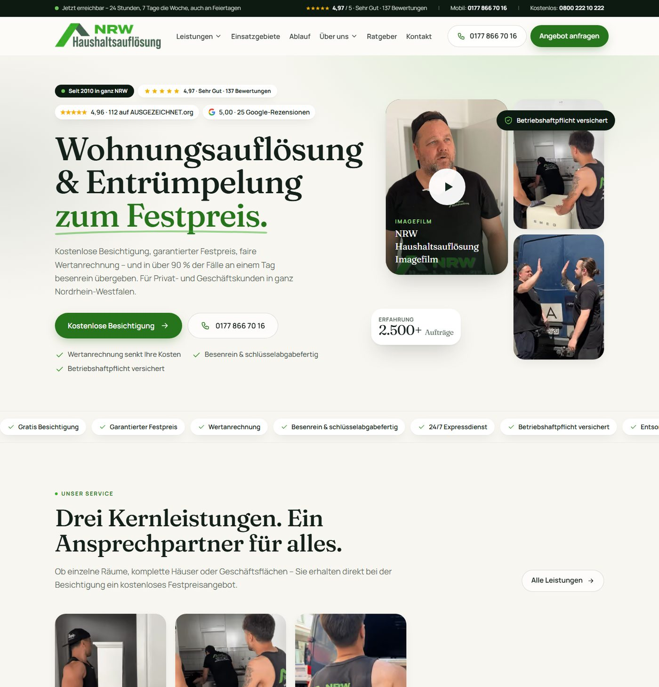
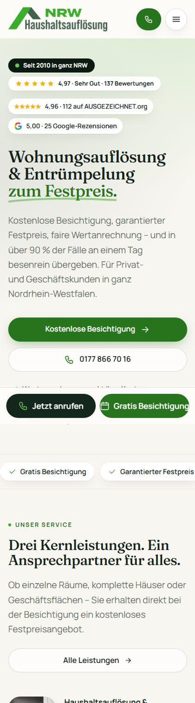

<div align="center">

# NRW-Haushaltsauflösung

**Website for a household clearance and decluttering company in North Rhine-Westphalia, Germany.**

A complete rebuild of [nrw-haushaltsaufloesung.de](https://www.nrw-haushaltsaufloesung.de) — same content, same identity, new design and a static Next.js front end.

[](https://nextjs.org)
[](https://react.dev)
[](https://www.typescriptlang.org)
[](https://tailwindcss.com)
[](#performance--seo)
[](#performance--seo)



</div>

---

## What this website is for

NRW-Haushaltsauflösung is a family-run business from Düsseldorf, active since 2010, that empties homes and commercial spaces across North Rhine-Westphalia. People come to the site in situations that are rarely happy ones: a parent has died and the flat has to be handed back, a move to a care home is due, a landlord needs a property cleared, or a business is closing down.

The site therefore has one job — **let someone in that situation understand the service and request a free, no-obligation viewing in as few steps as possible.**

Every page is built around that:

- The phone number and a request button are reachable from any screen, including a sticky call bar on mobile.
- The pricing model is stated everywhere: free viewing, a guaranteed fixed price on the spot, the value of reusable goods offset against that price, no advance payment.
- 44 city pages answer the "do you work in my town?" question directly, and 196 guide articles answer the questions people search for before they call.

### Services covered

| Service | Page |
| --- | --- |
| Household and apartment clearance | `/haushaltsaufloesung-wohnungsaufloesung/` |
| Decluttering: cellar, attic, garage | `/entruempelung/` |
| Office and medical practice clearance | `/bueroaufloesung-praxisaufloesung/` |
| Estate purchase, senior moves, hoarder clearances, evictions, dismantling, transport | 18 further service pages |

---

## Site map

| Area | Pages | Source |
| --- | --- | --- |
| Home, Services, Service areas, Process, Reviews, FAQ, About, Social commitment, Contact, Thank you, Imprint, Privacy | 12 | `content/site.json` + `content/pages.json` |
| Service and specialty pages | 21 | `content/pages.json` → `components/templates/service-page.tsx` |
| City pages `/<city>/haushaltsaufloesung/` | 44 | `content/cities.json` |
| Guide index with search and topic filters | 1 | `content/posts-index.json` |
| Guide articles | 196 | `content/posts/*.json` → `components/templates/article-page.tsx` |

**279 pages, all statically generated at build time.**

The overview pages `/leistungen/`, `/einsatzgebiete/`, `/ablauf/`, `/bewertungen/` and `/faq/` are new. Everything on them already existed on the old site but was buried in one long homepage. Every article URL is unchanged so search rankings carry over. The empty WordPress parent pages `/<city>/` now redirect with a 308 to the city page, and `/tag/*`, `/category/*` and `/feed` redirect to the guide index.

---

## Design



- **Palette** built from the original brand green (`#3cad2b`) plus a deep forest tone and a warm paper background.
- **Type** pairs Fraunces for headlines with Manrope for body text, both self-hosted through `next/font`.
- **Photography** is the company's own. The source images are modest in resolution, so they are used small and in frames close to their native aspect ratio rather than stretched into wide banners.
- **No text over photos** anywhere, so nothing becomes unreadable on a busy image.
- **Motion** is limited to a trust marquee, the review wall and gentle scroll reveals. All of it stops for visitors who set `prefers-reduced-motion`.
- **Mobile first.** Every page hero fits one screen with its main button visible, and no page scrolls sideways at any width from 390 px upward.

<br clear="right">

---

## Performance and SEO

Lighthouse on the production build, simulated mobile:

| Page | Performance | Accessibility | Best practices | SEO |
| --- | --- | --- | --- | --- |
| Home | 90 | 100 | 100 | 100 |
| Services | 91 | 100 | 100 | 100 |
| City page | 88 | 100 | 100 | 100 |
| Contact | 92 | 100 | 100 | 100 |

Desktop home scores 99 to 100 for performance. Cumulative layout shift is 0 on every page.

- Structured data: `LocalBusiness` / `MovingCompany` with aggregate rating and `sameAs` links to both review portals, plus `Service`, `FAQPage`, `Article`, `HowTo` and `BreadcrumbList`.
- `sitemap.xml`, `robots.txt`, the web manifest and all icons are generated from the content.
- 782 images stored locally as WebP, served as AVIF or WebP through `next/image` with explicit dimensions.
- No third-party scripts by default. The company film only loads after a click, through `youtube-nocookie`.
- Customer ratings render from local data, 4.96 from 112 reviews on AUSGEZEICHNET.org and 5.00 from 25 Google reviews, with no external widget.

---

## Getting started

```bash
npm install
npm run dev      # http://localhost:3000
npm run build    # generates 279 static pages
npm run start
```

Copy `.env.example` to `.env.local` to configure contact form delivery and the optional tag manager container.

| Variable | Purpose |
| --- | --- |
| `RESEND_API_KEY` | Sends contact requests by email. Without it the form still works and logs to the server console. |
| `CONTACT_TO` | Recipient address, defaults to `kontakt@nrw-haushaltsaufloesung.de`. |
| `CONTACT_FROM` | Verified sender in Resend. |
| `NEXT_PUBLIC_GTM_ID` | Google Tag Manager container. Empty by default so no third-party script loads. |

---

## Project structure

```
app/                          routes (App Router)
  [slug]/                     service pages and guide articles
  [slug]/haushaltsaufloesung/ city pages
  leistungen/ einsatzgebiete/ ablauf/ bewertungen/ faq/ ...
  actions/contact.ts          contact form server action
components/
  templates/                  service page and article page layouts
  sections.tsx                shared sections: hero, process, reviews, contact
  review-carousel.tsx         continuously moving review wall
content/                      all site content as JSON
  site.json                   company data, services, benefits, FAQ, reviews
  cities.json                 44 city pages
  posts/                      196 guide articles
public/images/                782 migrated images (WebP)
scripts/migrate/              WordPress import scripts
scripts/qa/                   Playwright screenshot, overflow and end-to-end checks
```

---

## Editing content

Everything editable lives in `content/`, so copy changes need no component edits.

- **Company data.** Phone numbers, address, ratings, benefits, process steps, FAQ, customer reviews, service descriptions and regions: `content/site.json`.
- **City pages.** `content/cities.json`.
- **Guide articles.** One JSON file per article in `content/posts/`, plus an entry in `content/posts-index.json`.

## Re-running the migration

The scripts in `scripts/migrate/` pull everything from the old WordPress site through its REST API.

```bash
# raw export (pages.json, posts.json, media.json) into .migrate-cache/
node scripts/migrate/images.mjs        # downloads and converts images
node scripts/migrate/extract.mjs       # writes content/*.json
node scripts/migrate/brand-assets.mjs  # logo and Open Graph image
node scripts/migrate/favicon.mjs       # favicon set from the original icon
```

## Quality checks

```bash
node scripts/qa/shots.mjs http://localhost:3000     # full-page screenshots, desktop and mobile
node scripts/qa/mobile.mjs http://localhost:3000    # mobile screenshots
node scripts/qa/overflow.mjs http://localhost:3000  # horizontal overflow at six widths
node scripts/qa/e2e.mjs http://localhost:3000       # redirects, nav, search, form, FAQ, 404
```

---

## Deployment

A standard Next.js build with no database. It runs on Vercel, Netlify or any Node host through `npm run build && npm run start`.

When switching the domain over: set `RESEND_API_KEY`, point DNS at the new host, and keep the `/wp-content/uploads/*` redirect in `next.config.ts` until no external site links to the old image URLs.

---

<div align="center">
<sub>Built for NRW-Haushaltsauflösung · Marco van der Sande · Düsseldorf</sub>
</div>
